Arc42-Template SA
===

# User Stories

## 1. Wartungsplanung (Optimierte Terminierung)
**Titel:** Generierung von Wartungsvorschlägen basierend auf Real-Daten

**Story:**
Als **Wartungsplaner**
möchte ich, dass das System mir konkrete Terminvorschläge für Züge macht, basierend auf dem durch Sensoren bestätigten Verschleiß,
damit ich Züge nur dann aus dem Betrieb nehme, wenn es technisch notwendig ist, und ungeplante Ausfälle vermeide.

**Akzeptanzkriterien:**
* Der Vorschlag basiert nicht nur auf statistischer Prognose, sondern muss durch aktuelle Sensordaten (Vibration/Temperatur) validiert sein.
* Das System priorisiert Züge mit kritischen Verschleißwerten.
* Kleine Wartungsarbeiten werden gebündelt, wenn ein Termin für eine größere Komponente ansteht.

---

## 2. Bestellwesen (Predictive Ordering)
**Titel:** Automatisierte Bestellvorschläge bei erkanntem Bedarf

**Story:**
Als **Mitarbeiter im Einkauf**
möchte ich, dass das System automatisch Bestellvorschläge für Ersatzteile  generiert, sobald ein Austauschbedarf erkannt wird,
damit die benötigten Komponenten rechtzeitig vor dem Eintreffen des Zuges im Lager verfügbar sind und Lagerkosten durch "Just-in-Time"-Beschaffung optimiert werden.

**Akzeptanzkriterien:**
* Ein Bestellvorschlag wird generiert, sobald die Restlebensdauer einen definierten Schwellenwert unterschreitet.
* Der Vorschlag enthält die spezifische Teilenummer und den spätesten notwendigen Liefertermin.
* Das System berücksichtigt die prognostizierte Zeit bis zum Totalausfall.

---

## 3. Techniker (Plausibilitätsprüfung)
**Titel:** Visualisierung der Diskrepanz zwischen Prognose und Messwert

**Story:**
Als **Techniker**
möchte ich auf dem Dashboard grafisch sehen, wie stark der gemessene Ist-Zustand vom statistisch prognostizierten Soll-Verschleiß abweicht,
damit ich Fehlalarme (False Positives) sofort erkenne und nur valide Tauschempfehlungen freigebe.

**Akzeptanzkriterien:**
* Das Dashboard zeigt zwei Kurven/Werte: "Erwarteter Verschleiß (Historie)" und "Tatsächlicher Verschleiß (Sensor)".
* Signifikante Abweichungen zwischen Modell und Realität werden farblich hervorgehoben (z. B. Ampelsystem).
* Ich kann per Klick entscheiden, ob die Prognose ignoriert oder der Austausch bestätigt wird.


# Einführung und Ziele

Das System soll eine “Predictive Maintenance”-Lösung (vorausschauende Wartung) für Eisenbahnen bereitstellen mit dem Ziel Ausfälle durch Vorhersage von Verschleiß zu vermeiden.

## Aufgabenstellung

Die Aufgabenstellung spezifiziert folgende Anforderungen:

* Erfassung von Sensordaten (Vibration, Temperatur, Laufleistung, ...)
* Speicherung und Analyse der Daten
* Prognose der Restlebensdauer von Komponenten
* Wartungsemfehlungen generieren
* Dashboard und Alarmierung für Techniker

## Qualitätsziele

Das übergeordnete Ziel ist die Vermeidung/Verringerung von Ausfällen durch die Vorhersage von Verschleiß.

| Qualitätsmerkmal | Ziel | SMART-Formulierung |
| :--- | :--- | :--- |
| **Verfügbarkeit / Zuverlässigkeit** | Vermeidung/Verringerung von Ausfällen durch Vorhersage von Verschleiß. | **Reduktion ungeplanter Ausfälle:** Innerhalb von 12 Monaten nach Systemeinführung wird die Rate der ungeplanten Zugausfälle aufgrund von Komponentenverschleiß (z. B. Bremsen) um **x %** im Vergleich zum Vorjahr gesenkt. |
| **Funktionalität / Genauigkeit** | Prognosegenauigkeit: Vorhersage der Restlebensdauer von Komponenten. | **Präzision der RUL-Prognose:** Die prognostizierte Restlebensdauer (Remaining Useful Life) weicht beim Zeitpunkt des tatsächlichen Austauschs um maximal **±x %** von der realen Abnutzung ab (validiert durch Abgleich mit Sensordaten). |
| **Effizienz** | Prozesseffizienz: Generierung von konkreten Wartungsempfehlungen. | **Optimierung der Wartungsintervalle:** Durch das Bündeln von kleinen Reparaturen ("kleine Dinge") mit großen Wartungsereignissen wird die Anzahl der separaten Werkstattaufenthalte pro Zug im ersten Betriebsjahr um **x %** reduziert. |
| **Benutzbarkeit / Zeitverhalten** | Transparenz: Bereitstellung eines Dashboards und Alarmierung für Techniker. | **Reaktionszeit der Alarmierung:** Kritische Zustände (z. B. "neue Bremse nötig") werden innerhalb von **5 Minuten** nach Dateneingang im Dashboard visualisiert und als Alarm an den zuständigen Techniker gesendet. |
| **Effizienz / Automatisierung** | Bestellprozess abbilden / Predictive Ordering. | **Automatisierungsgrad Beschaffung:** Für x % der als "kritisch" vorhergesagten Komponenten wird spätestens **y Tage** vor dem errechneten Austauschdatum automatisch ein Bestellvorschlag generiert. |

## Stakeholder

| Rolle | Erwartungshaltung |
|---|---|
| **Techniker** |  Benötigt ein Dashboard und Alarmierung bei kritischen Zuständen. Erwartet klare Anweisungen, wenn Bauteile (z.B. Bremsen) getauscht werden müssen. |
| **Wartungsplaner** | Erwartet konkrete Wartungsempfehlungen und eine Priorisierung von Fehlern. Möchte viele "kleine Dinge" sammeln, um sie effizient bei einer "größeren Aktion" gebündelt abzuarbeiten. |
| **Einkauf / Beschaffung** | Erwartet die Abbildung des Bestellprozesses sowie "Predictive Bestellungs-Vorschläge", um Ersatzteile rechtzeitig vorrätig zu haben. |
| **Management / Betreiber** |  Primäres Ziel ist die Vermeidung von Ausfällen durch Vorhersage von Verschleiß, sowie bessere Planbarkeit von Wartungen. Erwartet eine Auslagerung der tatsächlichen Wartung aus dem digitalen Prozess. |
| **Data Scientist / Analyst** |  Benötigt Zugriff auf Sensordaten (Vibration, Temperatur, etc.) und historische Daten der letzten Jahre zur Kalibrierung und Erstellung der Prognosemodelle. |
| **Entwicklerteam** | Benötigt Informationen von Domänenexperten und klare Anforderungen zu den Features für die anderen Stakeholder. |
| **Passagiere** | Erwarten, dass Zugbetreiber sinnvolle Investitionen machen um einen reibungslosen Zugverkehr benutzen zu können. |
| **Zugführer** | Erwartet einen pünktlichen Betrieb ohne ungeplante Stopps. Möchte, dass Verschleißteile getauscht werden, bevor Warnlampen während der Fahrt aufleuchten, um die Fahrgastsicherheit und den Fahrplan nicht zu gefährden. |
| **Politik**(Verkehrsministerium) | Erwartet eine höhere Zuverlässigkeit und Pünktlichkeit des Schienenverkehrs sowie Kosteneffizienz, um die Attraktivität des öffentlichen Nahverkehrs für die Bevölkerung zu steigern. | 

# Randbedingungen

* **Hardware-Bestand:** Die Sensoren sind an den Zügen bereits vorhanden, bzw. werden bei Regelwartungen nachgerüstet
* **Datenbasis:** Für die Prognosemodelle stehen Daten aus den letzten x Jahren zur Verfügung
* **Abgrenzung:** Die tatsächliche physische Wartung wird aus dem Prozess ausgelagert

# Kontextabgrenzung

Das System verarbeitet (Live-)Daten von Zügen und historische Daten und liefert Entscheidungshilfen für Wartungsplaner, den Einkauf und Techniker.

## Fachlicher Kontext

**Eingaben:**
* Das System erfasst Sensordaten wie **Vibration, Temperatur und Laufleistung**
* Das System kann auf historische Daten (Sensordaten, Wartungshistorien) zugreifen

**Ausgaben:**
* **Dashboard:** Visuelle Aufbereitung und Alarmierung für Techniker
* **Bestellwesen:** Auslösen von Bestellungen (z.B. neue Bremse)
* **Wartungsplanung:** Geplante Wartungstermine für Züge

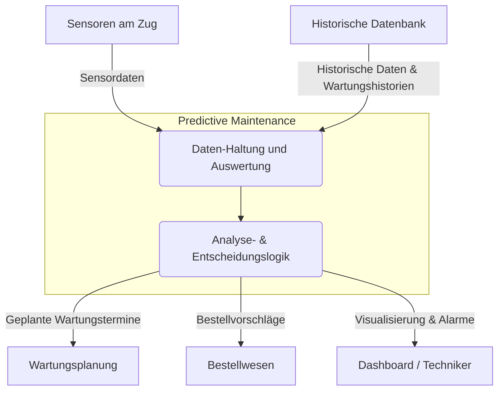

## Technischer Kontext

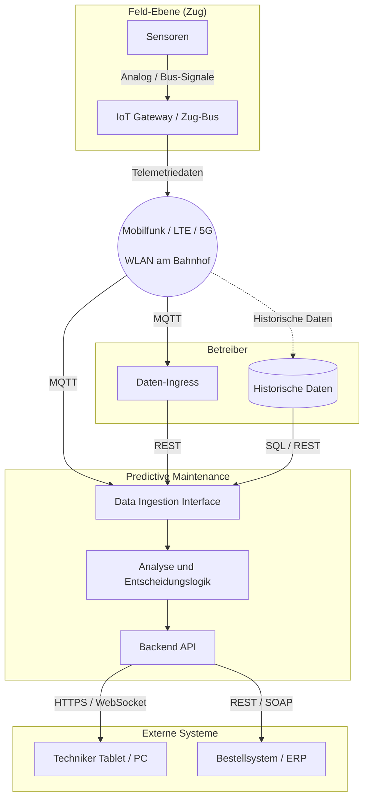

| Schnittstelle | Art | Beschreibung |
| :--- | :--- | :--- |
| **Schnittstelle 1: Sensor-Uplink** | **Input** | Die Sensoren (Vibration, Temperatur) sind bereits montiert. Die Daten werden über ein Gateway im Zug gesammelt und drahtlos an das System gesendet. |
| **Schnittstelle 2: Techniker-Dashboard** | **Output** | Webbasierte Oberfläche für Techniker. Ermöglicht Zugriff auf Alarme und Analysen. Zugriff erfolgt typischerweise über HTTPS via Tablet oder PC. |
| **Schnittstelle 3: ERP-Integration** | **Output** | Schnittstelle zum Bestellwesen. Übermittelt "Predictive Bestellungs-Vorschläge", wenn Komponenten (z. B. Bremsen) getauscht werden müssen. |

| Fachlicher Datenfluss | Technische Umsetzung (Vorschlag) | Format / Protokoll |
| :--- | :--- | :--- |
| **Sensordaten erfassen** | Übertragung vom Zug-Gateway an den Ingestion-Server via Mobilfunk. | JSON über MQTT |
| **Alarmierung** | Push-Notification oder Live-Update im Dashboard. | WebSocket / Server-Sent Events |
| **Bestellung auslösen**| API-Call an das externe Bestellsystem (Vorschläge). | REST oder SOAP |

# Lösungsstrategie

## Kurzzusammenfassung
Das System verfolgt einen **datengetriebenen Hybrid-Ansatz**: 

Es kombiniert statistische Auswertungen historischer Daten mit einer Echtzeit-Validierung aktueller Sensorwerte. Architektonisch wird eine strikte Trennung zwischen der Datenverarbeitung und den operativen Prozessen (Bestellung/Wartungsplanung) umgesetzt, um die bestehende Hardware minimalinvasiv einzubinden.

## Lösungsansätze für Qualitätsziele

| Qualitätsziel / Anforderung | Szenario / Problemstellung | Lösungsansatz | Referenz / Details |
| :--- | :--- | :--- | :--- |
| **Vermeidung von Ausfällen** (Reliability) | Bauteile fallen unerwartet aus, weil Verschleiß nicht erkannt wird. | **Predictive Analytics auf Historiedaten mit Validierung durch aktuelle Sensordaten:** Training von Prognosemodellen mit Daten der letzten Jahre, um die Restlebensdauer zu berechnen. Auswertung aktueller Daten zur Validierung der errechneten Restlebensdauern, bzw. Erkennung von frühzeitigem Verschleiß | *Konzept "Analyse"* |
| **Hohe Prognosegüte** (Accuracy) | Modelle liefern Fehlalarme, was zu unnötigen Kosten führt. | **Hybrid-Validierung:** Die statistische Prognose wird vor der Alarmierung zwingend gegen aktuelle Echtzeit-Sensordaten geprüft ("Abgleich ob wirklich notwendig"). | *Baustein "Analytics Engine"* |
| **Wartungseffizienz** (Efficiency) | Züge müssen für jede Kleinigkeit separat in die Werkstatt. | **Task Grouping (Bündelung):** Das System sammelt unkritische Mängel ("viele kleine Dinge") und plant deren Behebung gebündelt mit einer notwendigen Hauptwartung ("größere Aktion"). | *Baustein "Maintenance Optimizer"* |
| **Rechtzeitige Beschaffung** (Process Efficiency) | Ersatzteile (z. B. Bremsen) sind bei Bedarf nicht vorrätig. | **Predictive Ordering:** Das System generiert Bestellvorschläge proaktiv basierend auf der prognostizierten Restlaufzeit, nicht erst bei Defekt. | *Baustein "Order Manager"* |
| **Hardware-Unabhängigkeit** (Compatibility) | Nutzung der bereits im Feld vorhandenen Sensoren. | **Data Ingestion Layer:** Eine dedizierte Schicht zur Normalisierung der empfangenen/abgerufenen Daten entkoppelt die Analyse-Logik von der physischen Sensoranbindung. | *Schnittstelle "Sensor-Uplink"* |

## Organisations- und Technologieentscheidungen

* **Make-or-Buy:** Nutzung existierender Sensorik (keine Hardware-Neuentwicklung), aber Eigenentwicklung der Prognose-Logik.
* **Prozessgrenze:** Das System endet bei der Planung/Bestellung. Die tatsächliche physische Wartung ist explizit **Out-of-Scope** für die Softwarearchitektur.

# Bausteinsicht – Ebene 1

## Whitebox Gesamtsystem
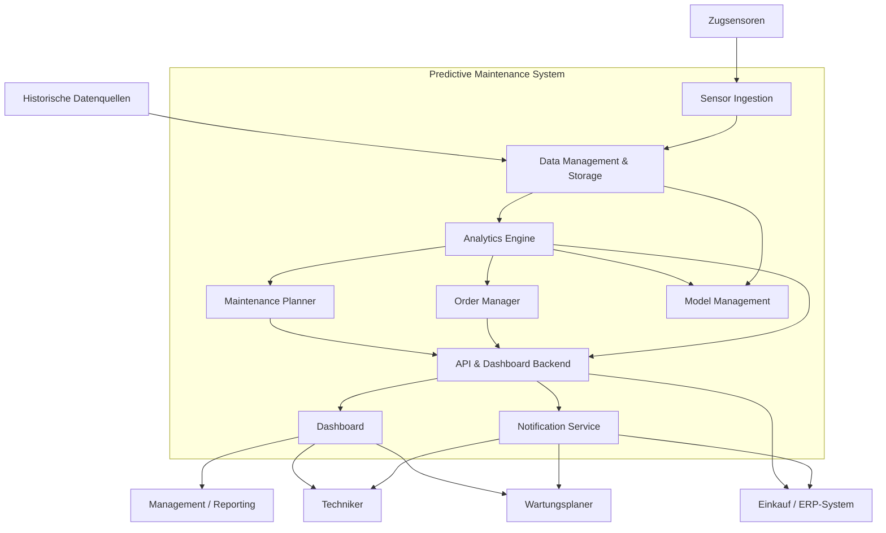

### Begründung

Die Zerlegung des Gesamtsystems folgt zwei Leitprinzipien:

1. **Datenflussorientierung:**  
   Vom Eingang der Sensordaten über Speicherung, Analyse und Ableitung von Maßnahmen bis hin zur Visualisierung und Integration in externe Systeme.  
   → Deckt die fachlichen Anforderungen wie Erfassung, Analyse, Prognosen, Empfehlungen und Alarmierung ab.

2. **Verantwortungsorientierung:**  
   - Trennung von Datenaufnahme, Analyse, Planung/Bestellung und Darstellung  
   - Klare fachliche Verantwortlichkeiten  
   → Erhöht Wartbarkeit, Austauschbarkeit von Modulen, Testbarkeit und Skalierbarkeit.

---

## Enthaltene Bausteine (Blackboxen)

### Sensor Ingestion
**Verantwortung**
- Empfang, Validierung und Normalisierung eingehender Sensordaten  
- Anreicherung mit Metadaten  
- Weiterleitung an das Data Management  

**Schnittstellen**
- Input: Sensor-Uplink (MQTT/REST)  
- Output: Normalisierte Messwerte an Data Management & Storage  

---

### Data Management & Storage
**Verantwortung**
- Persistenz von Rohdaten, Zeitreihen, Stammdaten und Historien  
- Performante Bereitstellung der Daten für Analyse und Modellverwaltung  

**Schnittstellen**
- Input: Normalisierte Sensordaten, historische Daten  
- Output: Datenabfragen für Analytics Engine und Model Management  

---

### Analytics Engine
**Verantwortung**
- Berechnung von Health-Scores, RUL-Prognosen und Anomalien  
- Auswertung historischer und aktueller Daten  
- Bereitstellung analytischer Ergebnisse für Wartung, Bestellung und Dashboard  

**Schnittstellen**
- Input: Daten aus Data Management, Modelle aus Model Management  
- Output: Prognosen und Ereignisse an Maintenance Planner, Order Manager, API  

---

### Maintenance Planner
**Verantwortung**
- Ableitung und Priorisierung von Wartungsmaßnahmen  
- Bündelung und Terminierung anhand externer Fahrplan-/Kapazitätsdaten  

**Schnittstellen**
- Input: Prognosen aus Analytics Engine  
- Output: Wartungsempfehlungen an API & Dashboard Backend, Signale an Order Manager  

---

### Order Manager
**Verantwortung**
- Ermittlung von Teilebedarf basierend auf RUL und Wartungsplänen  
- Berechnung von Bestellzeitpunkten  
- Erstellung von Bestellvorschlägen  

**Schnittstellen**
- Input: RUL/Kritikalität (Analytics), Wartungsinformationen (Maintenance Planner)  
- Output: Bestellvorschläge an ERP-System, Status-Events an API  

---

### API & Dashboard Backend
**Verantwortung**
- Exponierte Schnittstelle des Systems (REST/GraphQL, WebSocket/SSE)  
- Transformation von Domänendaten in UI-Modelle  
- Bereitstellung von Daten für das Dashboard und externe Systeme  

**Schnittstellen**
- Input: Daten aus Analytics, Maintenance Planner, Order Manager  
- Output: UI-spezifische Daten und Events an Dashboard; Benutzeraktionen zurück an System  

---

### Notification Service
**Verantwortung**
- Versand von Alarmen und Benachrichtigungen  
- Unterstützung verschiedener Kanäle (E-Mail, Push, Tickets)  

**Schnittstellen**
- Input: Events aus Analytics, Maintenance Planner, Order Manager, API  
- Output: Benachrichtigungen an Techniker, Planer, Einkauf  

---

### Model Management
**Verantwortung**
- Training, Evaluierung und Versionierung von Analysemodellen  
- Verwaltung von Schwellwerten und Konfigurationen  
- Nutzung von Feedback aus Praxis und Dashboard  

**Schnittstellen**
- Input: Daten aus Storage, Nutzerrückmeldungen aus API  
- Output: Modelle und Parameter an Analytics Engine  

---

### Dashboard (Frontend)
**Verantwortung**
- Visualisierung von Zuständen, Prognosen, Wartungsvorschlägen und Bestellungen  
- Interaktionen der Nutzer (Techniker, Planer, Einkauf, Management)  

**Schnittstellen**
- Input: REST/GraphQL-Daten und Echtzeit-Events vom API Backend  
- Output: Benutzeraktionen (Bestätigen, Ignorieren, Terminwahl)  

---

## Wichtige Schnittstellen

### Sensor-Uplink
- Typ: Externer Input  
- Protokoll: MQTT oder REST  
- Inhalt: Rohmesswerte, Zeitstempel, Zug-/Komponenten-IDs  

---

### Historische Datenquellen
- Typ: Externer Input  
- Protokoll: Batch-Import, CSV, SQL, REST  
- Inhalt: Historische Sensordaten, Wartungs-/Teilehistorien  

---

### Dashboard-Schnittstelle
- Typ: Externe IO-Schnittstelle  
- Protokoll: REST/GraphQL + WebSocket/SSE  
- Inhalt: Health-/RUL-Daten, Empfehlungen, Bestellvorschläge, Benutzeraktionen  

---

### ERP-Integration
- Typ: Externer Output  
- Protokoll: REST, SOAP, Message-Bus  
- Inhalt: Bestellvorschläge, ggf. Statusrückmeldungen  

# Bausteinsicht – Ebene 2

## Whitebox Analytics Engine

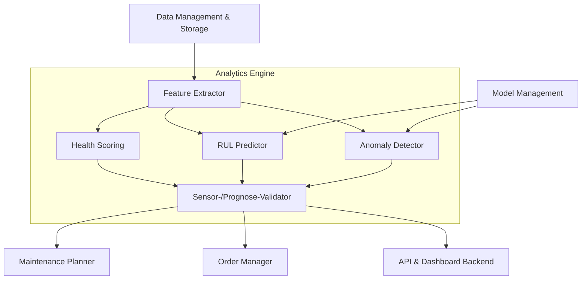

### Begründung

Die Analytics Engine wird in Datenaufbereitung, Modellanwendung und Validierung aufgeteilt.  
So lassen sich Modelle austauschen, neue Modelle ergänzen und der Hybrid-Ansatz (Prognose vs. Ist-Daten) sauber umsetzen.

### Enthaltene Bausteine (Blackboxes)

#### Feature Extractor

**Zweck / Verantwortung**
- Ableitung aussagekräftiger Features aus Rohdaten (z. B. RMS, Spektralmerkmale, Trendsteigungen).
- Aggregation über Zeitfenster (z. B. gleitende Durchschnitte).

**Schnittstellen**
- Input: Zeitreihen aus Data Management & Storage.
- Output: Feature-Vektoren an Health Scoring, RUL Predictor, Anomaly Detector.

---

#### Health Scoring

**Zweck / Verantwortung**
- Berechnung eines normierten Zustandsindikators (z. B. 0–100 %).
- Zuordnung zu Ampelstufen (grün/gelb/rot) für UI und Alarmierung.

**Schnittstellen**
- Input: Feature-Vektoren vom Feature Extractor.
- Output: Health-Scores an Sensor-/Prognose-Validator und API & Dashboard Backend.

---

#### RUL Predictor

**Zweck / Verantwortung**
- Berechnung der Restlebensdauer (Remaining Useful Life) für Komponenten.
- Nutzung trainierter Modelle (z. B. Regressions-, ML- oder Deep-Learning-Modelle).

**Schnittstellen**
- Input: Feature-Vektoren, Modellparameter/Artefakte aus Model Management.
- Output: RUL-Schätzungen an Sensor-/Prognose-Validator.

---

#### Anomaly Detector

**Zweck / Verantwortung**
- Erkennung atypischer Muster (z. B. plötzlicher Anstieg von Vibration).
- Identifikation von Abweichungen gegenüber Referenzverhalten.

**Schnittstellen**
- Input: Feature-Vektoren, Referenzmodelle/-profile aus Model Management.
- Output: Anomalie-Events an Sensor-/Prognose-Validator.

---

#### Sensor-/Prognose-Validator

**Zweck / Verantwortung**
- Abgleich von Health-Scores, RUL und Anomalien.
- Filterung von False Positives (z. B. Prognose meldet „kritisch“, Sensor sagt „okay“).
- Markierung verifizierter kritischer Fälle.

**Schnittstellen**
- Input: Health-Scores, RUL-Schätzungen, Anomalie-Events.
- Output: verifizierte Verschleißmeldungen und Prognosen an Maintenance Planner, Order Manager, API & Dashboard Backend.

---

## Whitebox Maintenance Planner

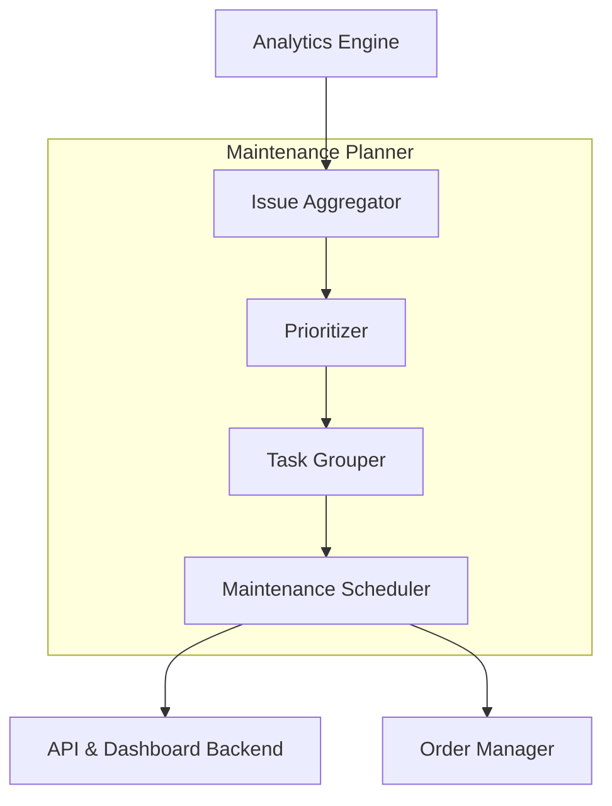

### Begründung

Die Planungslogik ist in klar getrennte Schritte aufgeteilt (Aggregation, Priorisierung, Bündelung, Terminierung).  
Dies unterstützt Erweiterbarkeit (z. B. neue Optimierungsalgorithmen) und klare Nachvollziehbarkeit der Entscheidungen.

### Enthaltene Bausteine (Blackboxes)

#### Issue Aggregator

**Zweck / Verantwortung**
- Konsolidierung aller Meldungen (kritische Health-Scores, Anomalien, RUL-Überschreitungen) je Zug/Komponente.
- Zusammenführung von Informationen aus mehreren Quellen (z. B. Analytics, Feedback der Techniker).

**Schnittstellen**
- Input: Events/Meldungen aus Analytics Engine, ggf. aus Dashboard/Techniker-Rückmeldungen.
- Output: normalisierte Issues (z. B. „Bremse Zug 4711 kritisch in 10 Tagen“).

---

#### Prioritizer

**Zweck / Verantwortung**
- Berechnung von Prioritäten für Issues basierend auf RUL, Sicherheitsrelevanz, Linienauslastung, SLAs.
- Markierung von Hochrisiko-Fällen für frühzeitige Behandlung.

**Schnittstellen**
- Input: Issues aus Issue Aggregator, Stammdaten/Konfiguration (z. B. Sicherheitsklassen).
- Output: priorisierte Issue-Liste an Task Grouper.

---

#### Task Grouper

**Zweck / Verantwortung**
- Bündelung von unkritischen Aufgaben mit größeren Wartungsereignissen („viele kleine Dinge“).
- Erzeugung von Wartungspaketen, die mehrere Issues zusammenfassen.

**Schnittstellen**
- Input: priorisierte Issues.
- Output: Wartungspakete (Gruppen von Tätigkeiten) an Maintenance Scheduler.

---

#### Maintenance Scheduler

**Zweck / Verantwortung**
- Zuordnung von Wartungspaketen zu konkreten Zeitfenstern und Werkstätten.
- Berücksichtigung von Fahrplänen, Werkstattkapazität und betrieblicher Restriktionen.
- Erzeugung konkreter Wartungsvorschläge für Wartungsplaner und Techniker.

**Schnittstellen**
- Input: Wartungspakete, Fahrplan-/Kapazitätsdaten (extern).
- Output: Wartungstermine/Vorschläge an API & Dashboard Backend, Ereignisse an Order Manager.

---


## Whitebox Order Manager
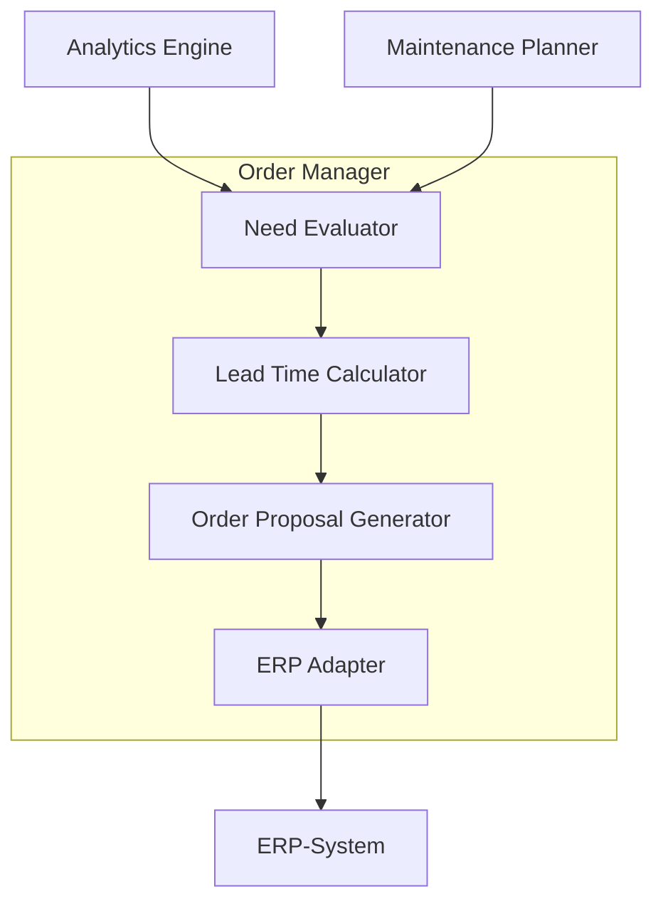
### Begründung

Die Bedarfsermittlung wird von der technischen ERP-Anbindung getrennt, um bei ERP-Wechseln nur den Adapter austauschen zu müssen.  
Fachliche Logik (Bestellbedarf, Lieferzeiten) bleibt unabhängig von der konkreten Systemintegration.

### Enthaltene Bausteine (Blackboxes)

#### Need Evaluator

**Zweck / Verantwortung**
- Entscheidung, ob auf Basis von RUL, Kritikalität und geplanten Wartungsterminen ein Teilebedarf entsteht.
- Ermittlung der betroffenen Komponenten und Mengen.

**Schnittstellen**
- Input: verifizierte Verschleißmeldungen/RUL-Werte aus Analytics Engine, Wartungspläne aus Maintenance Planner, Stammdaten aus Data Management.
- Output: Bedarfseinträge (Komponente, Zug, Zeitpunkt, Menge) an Lead Time Calculator.

---

#### Lead Time Calculator

**Zweck / Verantwortung**
- Berechnung des spätesten Bestellzeitpunkts unter Berücksichtigung von Lieferzeiten, Pufferzeiten und Lagerbestand.
- Unterscheidung zwischen Lagerware und Bestellware.

**Schnittstellen**
- Input: Bedarfseinträge, Lieferzeiten und Lagerdaten aus ERP / Stammdaten.
- Output: Bedarf mit „Bestellen bis spätestens“-Information an Order Proposal Generator.

---

#### Order Proposal Generator

**Zweck / Verantwortung**
- Erstellung fachlicher Bestellvorschläge inkl. Teilenummer, Menge, spätester Liefertermin.
- Aggregation ähnlicher Bedarfe (z. B. mehrere Züge, gleiche Teile).

**Schnittstellen**
- Input: Bedarf + Bestellzeitpunkte vom Lead Time Calculator.
- Output: Bestellvorschläge an ERP Adapter, Events an API & Dashboard Backend.

---

#### ERP Adapter

**Zweck / Verantwortung**
- Technische Kommunikation mit dem ERP-/Bestellsystem.
- Umsetzung der Bestellvorschläge in ERP-spezifische API-Calls.
- Optional: Auswertung von Rückmeldungen (Bestellstatus, Lieferdatum).

**Schnittstellen**
- Input: Bestellvorschläge vom Order Proposal Generator, ggf. Statusanforderungen.
- Output: Requests an ERP-System, Statusupdates an Order Manager und API & Dashboard Backend.

---

## Whitebox API & Dashboard Backend
```mermaid
graph LR
    subgraph API["API & Dashboard Backend"]
        REST[REST/GraphQL API]
        WS[WebSocket/SSE Gateway]
        DTO[View Model Mapper]
    end

    ANA[Analytics Engine]
    MP[Maintenance Planner]
    OM[Order Manager]
    NOTIF[Notification Service]
    DASH[Dashboard]

    ANA --> DTO
    MP --> DTO
    OM --> DTO

    DTO --> REST
    DTO --> WS

    REST --> DASH
    WS --> DASH
    NOTIF --> DASH

    DASH --> REST  %% User-Aktionen (Bestätigen, Ignorieren etc.)
```

### Begründung

Dieser Baustein bildet die Fassade des Systems nach außen. Transport-/Protokollthemen werden von der fachlichen Darstellung (DTOs/View-Modelle) getrennt, um flexibel auf UI-Anforderungen und externe Integrationen reagieren zu können.

### Enthaltene Bausteine (Blackboxes)

#### REST/GraphQL API

**Zweck / Verantwortung**
- Bereitstellung von Endpunkten für Abfragen und Aktionen.
- Umsetzung der fachlichen Use Cases als HTTP-APIs (z. B. Wartungsvorschläge laden, Bestellvorschläge bestätigen, Prognosen anzeigen).

**Schnittstellen**
- Input: HTTP(S)-Anfragen vom Dashboard und externen Systemen.
- Output: JSON/GraphQL-Responses mit View-Models, Fehlercodes, Statusinformationen.

---

#### WebSocket/SSE Gateway

**Zweck / Verantwortung**
- Bereitstellung eines Push-Kanals für Live-Updates und Alarme.
- Verwaltung und Überwachung der Clientverbindungen.

**Schnittstellen**
- Input: Events aus Analytics Engine, Maintenance Planner, Order Manager, Notification Service (z. B. intern über Message-Bus).
- Output: Live-Events an das Dashboard (z. B. `alarmCreated`, `healthUpdated`, `orderProposalCreated`).

---

#### View Model Mapper

**Zweck / Verantwortung**
- Transformation interner Domänenmodelle in UI-spezifische View-Modelle/DTOs.
- Aggregation von Daten aus mehreren Quellen zu konsistenten UI-Objekten (z. B. Kombination von Health, RUL, Historie).

**Schnittstellen**
- Input: Domänenobjekte und Antworten aus Analytics Engine, Maintenance Planner, Order Manager, Data Management.
- Output: API-spezifische DTOs an REST/GraphQL API und WebSocket/SSE Gateway.

---


# Laufzeitsicht
Nachfolgend werden fünf Laufzeitszenarien dargestellt. Jedes Szenario enthält: Ziel, beteiligte Komponenten (Akteure), Ablaufschritte sowie ein Sequenzdiagramm.

## Szenario A — Predictive Ordering (Bremsbelag: automatisierte Bestellvorschlagserzeugung)

### Ziel
Automatisierte Erzeugung eines Bestellvorschlags, sobald die prognostizierte Restlebensdauer eines Bremsbelags einen definierten Schwellwert unterschreitet und die Validierung gegen aktuelle Sensordaten erfolgreich ist.

### Beteiligte Komponenten
- **Sensors (Zug-Gateway)**
- **Ingestion (Data Ingestion Interface)**
- **Data Management & Storage**
- **Analytics Engine**  
  (Feature Extractor → RUL Predictor → Validator)
- **Order Manager**  
  (Need Evaluator → Lead Time Calculator → Order Proposal Generator)
- **ERP Adapter / ERP-System**
- **Notification Service / API & Dashboard Backend**

### Ablauf

#### Kurzbeschreibung
1. Kontinuierliche Übertragung von Vibrations-, Temperatur- und Laufleistungsdaten an das Ingestion-Interface.  
2. Persistenz und Normalisierung der Rohdaten im Data Management.  
3. Auslösung der Feature-Extraktion und Übergabe der Merkmalsvektoren an den RUL Predictor.  
4. Berechnung der Restlebensdauer der Bremskomponente.  
5. Prüfung der Konsistenz zwischen Prognose und aktuellen Sensorwerten durch den Validator.  
6. Erzeugung eines Bedarfseintrags durch den Need Evaluator.  
7. Berechnung des spätesten Bestellzeitpunkts unter Berücksichtigung von Lagerbestand und Lieferzeiten.  
8. Generierung des Bestellvorschlags und Übergabe an das ERP-System über den ERP Adapter.  
9. Aktualisierung von Dashboard und Notification Service sowie Benachrichtigung von Einkauf und Technik.

#### Sequenzdiagramm 

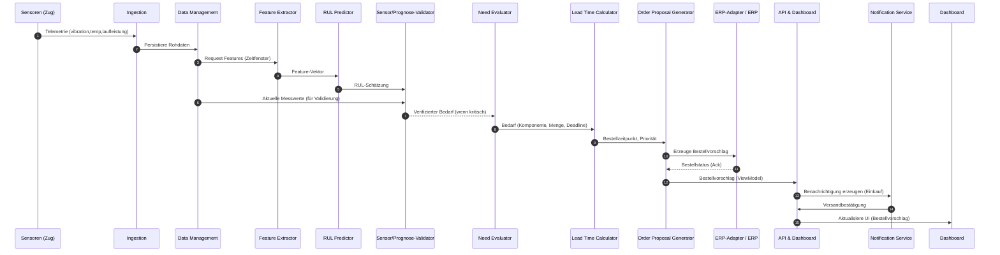
## Szenario B — Wartungsoptimierung (Bündelung kleiner Reparaturen mit Hauptwartung)

### Ziel
Bündelung kleinerer Reparaturaufgaben mit einem anstehenden größeren Wartungstermin zur Reduktion von Werkstattaufenthalten und effizienter Ressourcennutzung.

### Beteiligte Komponenten
- **Analytics Engine**
- **Maintenance Planner**  
  (Issue Aggregator → Prioritizer → Task Grouper → Maintenance Scheduler)
- **Data Management**  
  (Fahrplandaten, Werkstattkapazität)
- **API & Dashboard Backend**
- **Notification Service**

### Ablauf

#### Kurzbeschreibung
1. Erzeugung verifizierter Issues durch die Analytics Engine (Anomalien, RUL-Warnungen).  
2. Normalisierung und Gruppierung der Issues je Zug bzw. Komponente durch den Issue Aggregator.  
3. Bewertung der Issues anhand von Kritikalität, SLAs und Sicherheitsrelevanz durch den Prioritizer.  
4. Identifikation unkritischer Issues, die bis zum nächsten größeren Wartungsfenster gesammelt werden können, durch den Task Grouper.  
5. Vorschlag geeigneter Wartungszeitfenster durch den Maintenance Scheduler unter Berücksichtigung von Fahrplan- und Kapazitätsdaten.  
6. Darstellung des Vorschlags im Dashboard; Möglichkeit zur Bestätigung oder Anpassung durch den Planer.  
7. Weitergabe bestätigter Wartungspakete an den Order Manager (falls Material benötigt wird) sowie an den Notification Service.

#### Sequenzdiagramm 

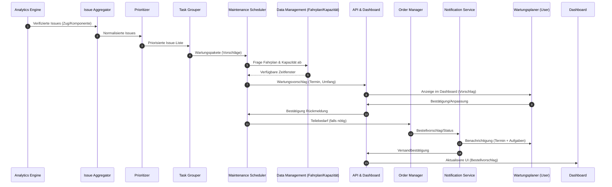

## Szenario C — Alarmierung und Techniker-Interaktion (Anomalie → Alarm → Plausibilitätsprüfung)

### Ziel
Sichere und nachvollziehbare Alarmierung eines Technikers bei plötzlich auftretenden Anomalien sowie Unterstützung der Plausibilitätsprüfung und Entscheidungsdokumentation im Dashboard.

### Beteiligte Komponenten
- **Sensors**
- **Ingestion**
- **Analytics Engine**  
  (Anomaly Detector → Validator)
- **API & Dashboard Backend**
- **Notification Service**
- **Techniker (Dashboard-Client)**
- **Model Management** (optional für Hinweise zur Modellunsicherheit)

### Ablauf

#### Kurzbeschreibung
1. Erfassung eines abrupten Anstiegs oder Einbruchs von Vibrationswerten durch Sensorik.  
2. Erzeugung eines Anomalie-Events durch den Anomaly Detector; Klassifikation der Dringlichkeit durch den Validator.  
3. Weiterleitung des Events an API und Notification Service; Auslösen eines Alarms.  
4. Zustellung der Benachrichtigung an den Techniker; Darstellung von Messkurven, Health-Scores, Prognosen und Modellunsicherheiten im Dashboard.  
5. Durchführung der Plausibilitätsprüfung durch den Techniker, einschließlich Vergleich aktueller Messwerte mit Prognosen und Bewertung potenzieller Umgebungsfaktoren.  
6. Auswahl einer Aktion durch den Techniker: Bestätigung (Wartung einleiten), Ignorieren (Fehlalarm) oder Beobachtung fortsetzen.  
7. Protokollierung der Nutzeraktion; optionales Feedback an das Model Management zur Modellverbesserung.

#### Sequenzdiagramm 

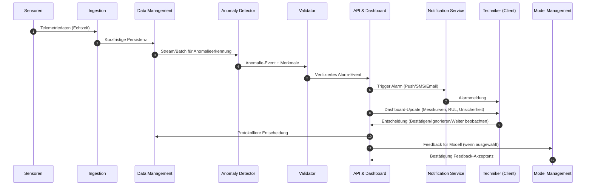

## Szenario D — Laufzeitüberwachung und Dashboard-Update (Realtime Monitoring)

### Ziel
Kontinuierliche Überwachung der Sensordaten eines Zuges, Berechnung relevanter Kennzahlen und Echtzeitvisualisierung im Dashboard für Techniker.

### Beteiligte Komponenten
- **Sensoren (Zug)**
- **Ingestion Interface** (Datenaufnahme)
- **Data Management / Short-Term Storage**
- **Analytics Engine** (Realtime Metrics)
- **API & Dashboard Backend**
- **Dashboard-Client (Techniker)**

### Ablauf

#### Kurzbeschreibung
1. Kontinuierliche Übermittlung von Sensordaten (Vibration, Temperatur, Laufleistung) durch die Sensorik.  
2. Empfang und kurzfristige Speicherung der Daten im Data Management über das Ingestion Interface.  
3. Berechnung von Realtime-Kennzahlen durch die Analytics Engine, z. B. Durchschnittswerte, Maximalwerte oder Abweichungen.  
4. Übermittlung der berechneten Kennzahlen an das Dashboard Backend.  
5. Echtzeitaktualisierung und Visualisierung der Messkurven, Trends und Zustände im Dashboard-Client für Techniker.  
6. Darstellung kritischer Schwellenwertüberschreitungen durch farbliche Markierungen oder Hinweise zur sofortigen Reaktion.

#### Sequenzdiagramm 

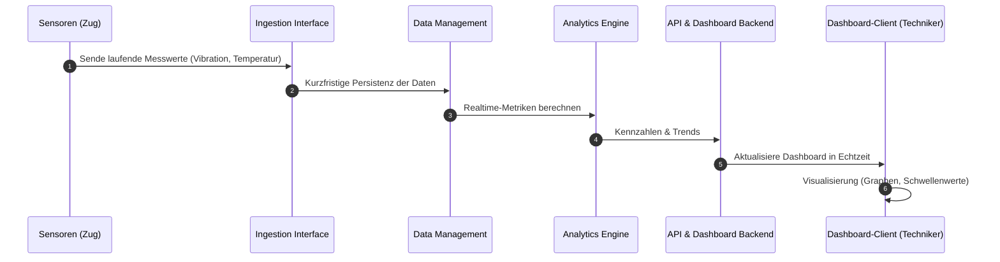

## Szenario E — Modell-Update und Retraining (Model Management Workflow)

### Ziel
Sichere Aktualisierung eines Vorhersagemodells zur Restlebensdauer- oder Anomaliedetektion unter Wahrung der Versionierbarkeit, reproduzierbarer Trainingspipelines und der Integration von Felddaten.

### Beteiligte Komponenten
- **Data Management & Storage**  
  (historische Daten, Label- und Feedback-Daten)
- **Model Management**  
  (Trainingspipeline, Evaluierung, Versionierung)
- **Analytics Engine**  
  (Bereitstellung und Deployment neuer Modelle)
- **API & Dashboard**  
  (Rollout-Status, Monitoring-Metriken)
- **Data Scientist / Operator**

### Ablauf

#### Kurzbeschreibung
1. Bereitstellung historischer Daten, gelabelter Wartungsfälle und Techniker-Feedback im Data Management.  
2. Start der Trainingspipeline durch das Model Management einschließlich Feature-Engineering, Modelltraining, Cross-Validation und abschließender Evaluierung.  
3. Ermittlung relevanter Leistungsmetriken wie MAE für RUL-Modelle oder Precision/Recall für Anomaliedetektoren.  
4. Versionierung und Bereitstellung eines neuen Modells im Staging-Endpunkt der Analytics Engine nach Erfüllung definierter Qualitätskriterien.  
5. Durchführung von Shadow-Testing oder Canary-Rollout über ein begrenztes Zeitfenster einschließlich Überwachung der Performancedaten.  
6. Promotion des Modells zum Produktionsendpoint bei erfolgreicher Validierung sowie Aktualisierung von Dashboard und API.  
7. Archivierung älterer Modellversionen einschließlich Metadaten und Trainingsartefakten.

#### Sequenzdiagramm 

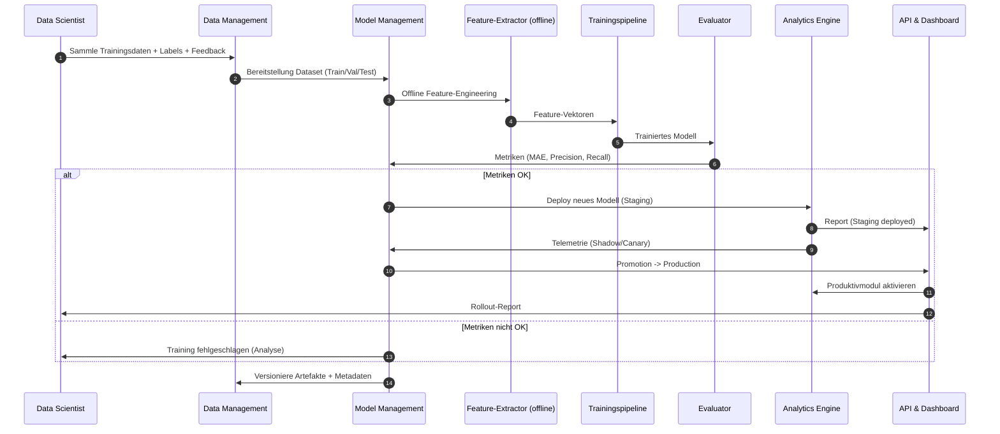

# Verteilungssicht

## Infrastruktur Ebene 1

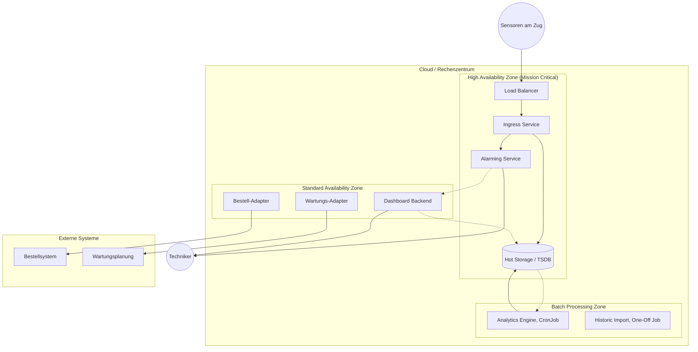

### Begründung

Die Infrastruktur ist in Zonen unterteilt, um den unterschiedlichen Anforderungen an Verfügbarkeit und Skalierbarkeit gerecht zu werden.

* **High Availability Zone:** Da Sensordaten kontinuierlich einströmen und Alarme zeitkritisch sind, müssen diese Komponenten redundant ausgelegt sein. Ein Ausfall hier würde zu Datenverlust führen.
* **Batch Processing Zone:** Die aufwendigen Analysen müssen nicht in Echtzeit laufen. Durch die Auslagerung in periodische Jobs (Jobs/CronJobs) werden Ressourcen gespart und Lastspitzen im Live-System vermieden.
* **Standard Availability Zone:** Dashboard und Schnittstellen zu Drittsystemen sind wichtig, aber ein kurzzeitiger Ausfall (z.B. beim Redeployment) ist tolerierbar und führt nicht zu Datenverlust oder Sicherheitsrisiken.

### Qualitäts- und/oder Leistungsmerkmale

* **Hochverfügbarkeit (99,99%):** Garantiert für Ingress und Alarming durch Replikation über mehrere Verfügbarkeitszonen (Availability Zones).
* **Skalierbarkeit:** Der Ingress-Layer skaliert automatisch horizontal mit der Anzahl der aktiven Züge/Sensoren.
* **Kosteneffizienz:** Analytics-Ressourcen werden nur während der Job-Laufzeit (z.B. nachts oder stündlich) beansprucht.

### Zuordnung von Bausteinen zu Infrastruktur

| Baustein | Infrastruktur-Zone | Art der Ausführung |
| --- | --- | --- |
| **Data Ingestion** | High Availability Zone | Always-On Service (ReplicaSet) |
| **Alarming Core** | High Availability Zone | Stream Processing / Event Driven |
| **Sensor-Datenbank** | High Availability Zone | Geclusterte Time-Series Database |
| **Analytics Engine** | Batch Processing Zone | Geplanter Job (CronJob) |
| **Historic Data Import** | Batch Processing Zone | Einmaliger Job (Run-Once) |
| **Dashboard / UI** | Standard Zone | Web Server Container |
| **Order/Maint Manager** | Standard Zone | Microservices |

---

## Infrastruktur Ebene 2

### High Availability Zone (Ingress & Alarming)

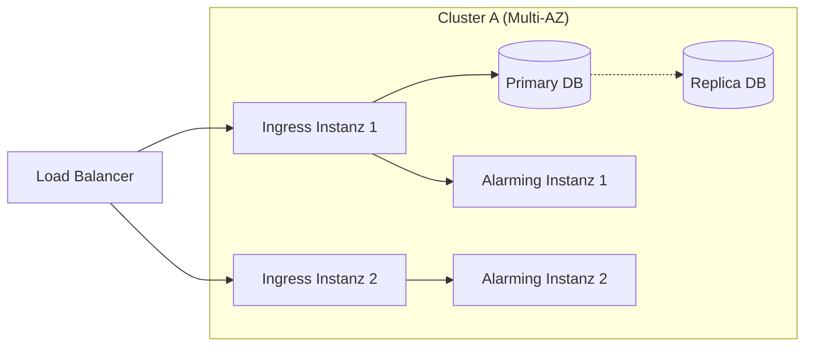

**Erläuterung:**

* Die **Data Ingestion** und das **Alarming** laufen als replizierte Services auf mehreren Knoten (Nodes), idealerweise verteilt auf verschiedene Rechenzentrums-Brandabschnitte.
* Ein **Load Balancer** verteilt den eingehenden Sensor-Traffic.
* Die Datenbank (z.B. InfluxDB oder TimescaleDB) wird im Cluster-Modus betrieben, um Schreiboperationen auch bei Ausfall eines Knotens zu sichern.

### Batch Processing Zone (Analytics)

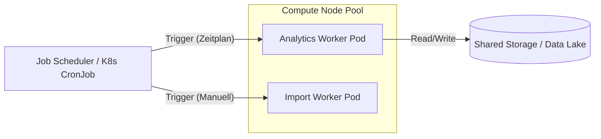

**Erläuterung:**

* Die **Analytics Engine** ist nicht dauerhaft aktiv. Sie wird vom Scheduler (z.B. Kubernetes CronJob) in regelmäßigen Intervallen gestartet, lädt die neuen Sensordaten, berechnet die Prognosen und schreibt die Ergebnisse zurück.
* Der **Import der historischen Daten** ist als Job konfiguriert, der nur initial oder bei Bedarf manuell getriggert wird. Er benötigt temporär hohe Ressourcen, gibt diese nach Abschluss aber wieder frei.


# Querschnittliche Konzepte

## Datenhaltung und Archivierung

Da das System auf der Analyse von Zeitreihen (Time-Series) basiert, wird ein mehrstufiges Speicherkonzept verfolgt ("Polyglot Persistence"):

* **Hot Storage (Echtzeit):** Aktuelle Sensordaten der Züge (Vibration, Temperatur) werden in einer hochperformanten Time-Series-Datenbank (TSDB) gespeichert. Diese Datenbasis dient dem Alarmierungssystem und dem Dashboard für den schnellen Zugriff auf die letzten 24-48 Stunden.
* **Cold Storage / Data Lake (Historie):** Für das Training der KI-Modelle werden Daten über lange Zeiträume ("x Jahre") benötigt. Diese werden kosteneffizient in einem Object Storage (Data Lake) archiviert. Ein "Lifecycle Management" verschiebt Daten automatisch von Hot nach Cold.
* **Relationale Daten (Stammdaten):** Informationen zu Zügen, Bauteil-Spezifikationen, Wartungsterminen und Bestellungen werden in einer relationalen Datenbank gehalten, um Transaktionssicherheit (ACID) für Bestellprozesse zu gewährleisten.

## Kalibrierung und Sensor-Health

Die Qualität der Prognose steht und fällt mit der Qualität der Eingabedaten.

* **Voraussetzung:** Sensoren müssen physikalisch korrekt montiert und kalibriert sein, bevor ihre Daten in das System fließen.
* **Metadaten-Flag:** Jeder Datensatz wird mit einer Sensor-ID verknüpft, die Informationen über den Kalibrierungsstatus enthält. Daten von als "unkalibriert" oder "defekt" markierten Sensoren werden vom *Ingestion Service* automatisch verworfen oder gesondert geflaggt, um das Training der Modelle nicht zu verfälschen ("Garbage In, Garbage Out").

## 8.3 Validierungslogik (Hybrid-Ansatz)

Ein zentrales fachliches Konzept ist die Vermeidung von Fehlalarmen durch doppelte Bodenbildung. Keine kritische Aktion (Bestellung/Alarm) darf allein auf einer statistischen Langzeitprognose basieren.

* **Regel:** `Alarm = (Prognose == kritisch) AND (Aktueller Sensorwert > Toleranzschwelle)`
* **Umsetzung:** Diese Logik ist als querschnittliches Regelwerk sowohl in der *Analytics Engine* (für langfristige Planung) als auch im *Alarming Service* (für akute Warnungen) implementiert.

## 8.4 Kommunikation und Asynchronität

Aufgrund der mobilen Natur der Züge und der potenziell instabilen Mobilfunkverbindungen setzt das System auf asynchrone Kommunikationsmuster.

* **Fire-and-Forget (Sensorik):** Sensordaten werden via MQTT oder vergleichbaren IoT-Protokollen versendet. Das System ist darauf ausgelegt, mit "Out-of-Order" Nachrichten (Datenpakete, die verspätet eintreffen) umzugehen, indem es Zeitstempel bei der Ingestion normalisiert.
* **Message Queuing (Intern):** Zwischen *Data Ingestion* und der Verarbeitung (*Alarming/Analytics*) kommen Message Broker (z.B. Kafka/RabbitMQ) zum Einsatz, um Lastspitzen abzufedern (Backpressure Handling).

## 8.5 Sicherheit (Security)

* **Transportverschlüsselung:** Jegliche Kommunikation zwischen Zug (Gateway) und Cloud sowie zwischen Client (Techniker) und Dashboard erfolgt ausschließlich verschlüsselt (TLS/mTLS).
* **Rollensystem (RBAC):** Der Zugriff auf Daten und Funktionen wird strikt getrennt:
    * *Techniker:* Lesezugriff Dashboard, Schreibzugriff Wartungsbestätigung.
    * *Planer/Einkauf:* Zugriff auf Reports und Bestellfunktionen.
    * *System:* Schreibzugriff für Sensoren (nur via API-Token).

## 8.6 Benutzeroberfläche und Usability

* **Ampelsystem:** Um die Komplexität der Daten für Techniker und Planer reduzierbar zu machen, wird querschnittlich ein visuelles Ampelsystem verwendet:
    * 🟢 **Grün:** Prognose und Ist-Werte im Normbereich.
    * 🟡 **Gelb:** Prognostiziertes Wartungsende naht ODER leichte Auffälligkeit im Sensor ("Observation Mode").
    * 🔴 **Rot:** Akuter Handlungsbedarf (Prognose überschritten & Sensor bestätigt Fehler).

# 9. Architekturentscheidungen

## ADR-001: Nutzung der existierenden Sensor-Infrastruktur

* **Status:** Akzeptiert
* **Kontext:** Für die "Predictive Maintenance" werden Telemetriedaten (Vibration, Temperatur, Laufleistung) benötigt. Die Züge sind bereits mit Sensoren ausgestattet, jedoch liegen diese außerhalb der direkten Kontrolle des Entwicklungsteams ("Black Box"). Eine Neu-Ausstattung der Flotte wäre extrem teuer und zeitaufwendig.
* **Entscheidung:** Das System wird ausschließlich auf die **bereits existierende Sensor-Hardware** aufsetzen. Es werden keine neuen, systemspezifischen Sensoren entwickelt oder verbaut.
* **Konsequenzen:**
    * **Positiv:** Minimale Initialkosten (CAPEX) und sofortige Verfügbarkeit der Datenquellen.
    * **Negativ:** Abhängigkeit von der Qualität und Wartung externer Hardware.
    * **Mitigation:** Implementierung eines robusten "Data Ingestion Layers", der unkalibrierte oder fehlerhafte Sensordaten (Rauschen/Drift) aggressiv filtert, bevor sie in die Analyse gelangen.

## ADR-002: Einbeziehung historischer Daten für Modell-Training

* **Status:** Akzeptiert
* **Kontext:** Um den Verschleiß ("Remaining Useful Life") präzise vorherzusagen, benötigen die Machine-Learning-Modelle Trainingsdaten, die den Verlauf von "neu" bis "defekt" abbilden. Ein Start nur mit Live-Daten würde Monate dauern, bis erste Muster erkannt werden ("Cold Start").
* **Entscheidung:** Es ist zwingend erforderlich, **historische Sensordaten und Wartungsprotokolle der letzten Jahre** (aus Altsystemen/Archiven) in das System zu importieren, um die Modelle initial zu trainieren.
* **Konsequenzen:**
    * **Positiv:** Das System kann bereits kurz nach dem Go-Live valide Prognosen liefern.
    * **Negativ:** Hoher Aufwand für "Data Engineering" (ETL), um alte Formate zu bereinigen und zu harmonisieren.
    * **Risiko:** Wenn die historische Datenqualität schlecht ist, ist die initiale Prognosegüte niedrig.

## ADR-003: Entscheidungsunterstützung statt Autonomie ("Human-in-the-Loop")

* **Status:** Akzeptiert
* **Kontext:** Das System erkennt kritischen Verschleiß an sicherheitsrelevanten Bauteilen (z. B. Bremsen). Eine Falsch-Bestellung kostet Geld, eine unterlassene Wartung gefährdet Sicherheit. Soll das System Aktionen (Bestellung/Werkstatttermin) vollautomatisch auslösen?
* **Entscheidung:** Das System agiert als **Decision Support System**. Es generiert Handlungsempfehlungen und Warnungen, führt aber **keine autonomen, finalen Entscheidungen** aus. Jede Bestellung und jeder Wartungsauftrag muss von einem Menschen (Planer/Techniker) bestätigt werden.
* **Konsequenzen:**
    * **Positiv:** Haftungsrisiken werden minimiert; Fehlalarme führen nicht zu teuren Fehlbestellungen.
    * **Negativ:** Der Prozess ist langsamer als eine vollautomatisierte Kette ("Dark Factory").
    * **UX-Implikation:** Das UI muss den Techniker befähigen, die Empfehlung schnell zu verifizieren (Visualisierung Diskrepanz Soll/Ist).

## ADR-004: Trennung von Echtzeit-Alarming und Batch-Analytics

* **Status:** Akzeptiert
* **Kontext:** Es gibt zwei konkurrierende Anforderungen:
    1. Sofortige Alarmierung bei kritischen Sensorwerten (z. B. Überhitzung).
    2. Komplexe Berechnung der Restlebensdauer (Rechenintensiv, ändert sich langsam).
* **Entscheidung:** Wir implementieren eine **Lambda-Architektur** (oder vergleichbare Trennung):
    * **Speed Layer:** Stream-Processing für sofortige Grenzwertüberschreitungen (Alarm in < 5 Min).
    * **Batch Layer:** Periodische Jobs (z. B. nächtlich) für die aufwendige Neuberechnung der Verschleißmodelle.
* **Konsequenzen:**
    * **Positiv:** Hohe Reaktivität für Sicherheit bei gleichzeitiger Ressourceneffizienz für komplexe Analysen.
    * **Negativ:** Erhöhte Komplexität in der Datenhaltung und Architektur.

## ADR-005: Entkopplung von externen Legacy-Systemen (Adapter Pattern)

* **Status:** Akzeptiert
* **Kontext:** Das System muss Bestellungen an ein existierendes ERP und Termine an ein Wartungsplanungssystem senden. Diese Systeme sind oft veraltet, haben proprietäre Schnittstellen oder ändern sich unabhängig von unserem System.
* **Entscheidung:** Die Anbindung erfolgt strikt über das **Adapter Pattern (Ports & Adapters)**. Die interne Logik arbeitet nur gegen eine generische Schnittstelle (z. B. `OrderService`), die durch spezifische Adapter für das jeweilige Zielsystem implementiert wird.
* **Konsequenzen:**
    * **Positiv:** Änderungen im ERP-System erfordern keine Änderungen im Kern des Predictive-Maintenance-Systems, sondern nur am Adapter.
    * **Negativ:** Initial höherer Entwicklungsaufwand durch zusätzliche Abstraktionsschicht.

# Qualitätsanforderungen

## Übersicht der Qualitätsanforderungen

Die detaillierten Qualitätsziele wurden zu Projektbeginn definiert und nach dem SMART-Prinzip formuliert (siehe **Kapitel Qualitätsziele**).

Der Fokus der Architektur liegt auf der **Zuverlässigkeit** (Vermeidung von Ausfällen) und der **Funktionalität/Genauigkeit** (Korrekte Vorhersage der Restlebensdauer). Nachrangig, aber essenziell für die Akzeptanz, sind die **Benutzbarkeit** (Dashboard-Reaktionszeit) und die **Effizienz** (Optimierte Wartungsprozesse).

Die folgende Tabelle fasst die Referenzen zusammen:

| Qualitätsmerkmal | Kernanforderung | Referenz |
| :--- | :--- | :--- |
| **Zuverlässigkeit** | Reduktion der ungeplanten Zugausfälle um **x %**. | Siehe Kap 1.2 (Ziel 1) |
| **Genauigkeit** | Abweichung der RUL-Prognose maximal **±x %**. | Siehe Kap 1.2 (Ziel 2) |
| **Effizienz** | Reduktion der Werkstattbesuche durch Bündelung um **x %**. | Siehe Kap 1.2 (Ziel 3) |
| **Zeitverhalten** | Alarmierung im Dashboard innerhalb von **5 Minuten**. | Siehe Kap 1.2 (Ziel 4) |
| **Automatisierung** | Automatischer Bestellvorschlag **y Tage** vor Ausfall. | Siehe Kap 1.2 (Ziel 5) |

---

## Qualitätsszenarien

Um die Architektur gegen die Ziele zu prüfen, werden folgende Szenarien definiert. Diese dienen sowohl dem Testen während der Entwicklung als auch der Evaluation im laufenden Betrieb.

### Szenario 1: Erfolgreiche Wartungsoptimierung (Zielerreichung)

**Szenario:** Ein Zug sendet Vibrationsdaten, die auf einen Verschleiß der Bremse in ca. 4 Wochen hindeuten. Gleichzeitig steht in 3 Wochen eine Routine-Reinigung der Klimaanlage an.

**Erwartetes Verhalten (Qualitätsziele erreicht):**
1.  **Erkennung:** Die Analytics Engine berechnet die Restlebensdauer (RUL) der Bremse korrekt und markiert sie als "Austausch nötig in < 30 Tagen".
2.  **Bündelung (Effizienz):** Der *Maintenance Optimizer* erkennt den Konflikt und schlägt vor, den Bremsentausch vorzuziehen und mit der Reinigung der Klimaanlage in 3 Wochen zusammenzulegen.
3.  **Bestellung (Automatisierung):** Da der Termin in 3 Wochen fixiert wird, prüft der *Order Manager* den Lagerbestand und löst automatisch eine Bestellung für die Bremse aus, sodass sie rechtzeitig verfügbar ist.
4.  **Ergebnis:** Der Zug muss nur *einmal* in die Werkstatt. Ein ungeplanter Ausfall der Bremse wird verhindert.

---

### Szenario 2: Mangelnde Prognosegenauigkeit (Zielverfehlung)

**Szenario:** Das System prognostiziert für eine Komponente eine Restlaufzeit von noch 3 Monaten. Tatsächlich fällt das Bauteil jedoch bereits nach 2 Wochen aus und verursacht einen ungeplanten Stopp auf freier Strecke.

**Beobachtung (Qualitätsziel unterschritten):**
* Die Abweichung zwischen Prognose und Realität lag weit über den geforderten **±x %**.
* Das Ziel "Verfügbarkeit / Zuverlässigkeit" wurde verfehlt.

**Mögliche Gründe (Root Cause Analysis):**
1.  **Concept Drift:** Die historischen Trainingsdaten passen nicht mehr zur aktuellen Situation (z.B. Wetterbedingungen waren extremer als in den Trainingsjahren).
2.  **Sensor-Drift:** Der Sensor am Zug war unkalibriert und lieferte leicht verfälschte Werte, die vom System noch nicht als "Defekt" erkannt, aber falsch interpretiert wurden.
3.  **Modell-Schwäche:** Der Algorithmus gewichtet bestimmte Parameter (z.B. Laufleistung) zu stark gegenüber anderen (z.B. Vibration).

**Optionen zur Verbesserung (Architektur-Maßnahmen):**
* **Kurzfristig (Parameter-Tuning):** Anpassung der Schwellenwerte im *Alarming Service*. Einführung eines "Sicherheitsfaktors" (Puffer), sodass Warnungen aggressiver/früher ausgegeben werden.
* **Mittelfristig (Retraining):** Sofortige Aufnahme des Vorfalls in den "Gold Standard"-Datensatz und Neutraining der Modelle (Triggerung der *Analytics Engine* Pipeline).
* **Architektonisch (Sensor Health Layer):** Erweiterung des *Ingestion Layers* um eine komplexere Plausibilitätsprüfung, die schleichende Sensor-Drifts besser erkennt, bevor die Daten in die Prognose einfließen.
* **Prozessual (Feedback-Loop):** Einbau einer Funktion im Techniker-Dashboard, mit der Techniker fehlerhafte Prognosen direkt flaggen können ("War noch gut" vs. "War schon kaputt"), um das Modell schneller zu korrigieren.

---

### Szenario 3: Latenzprobleme bei Massendaten (Lasttest)

**Szenario:** Durch eine Störung im Mobilfunknetz senden 50 Züge gleichzeitig ihre gepufferten Daten der letzten 2 Stunden an den *Ingress Service* (Thundering Herd Problem).

**Anforderung (Zeitverhalten):** Trotz der Lastspitze müssen kritische Alarme ("Bremse heiß") innerhalb von **5 Minuten** im Dashboard erscheinen.

**Verhalten bei Unterschreitung (Failure Case):**
* Wenn das System blockiert und der Alarm erst nach 20 Minuten erscheint, ist das Qualitätsziel verfehlt.
* **Maßnahme:** Skalierung der *Ingress*-Pods (Horizontal Pod Autoscaling) und Einsatz einer Message Queue (Kafka/RabbitMQ) als Puffer, wobei Alarm-Nachrichten in einer "High Priority Lane" an der Analytics-Engine vorbei direkt zum Dashboard geroutet werden (Fast Lane Pattern).

# Risiken und technische Schulden

## Risikomanagement

Die folgende Tabelle listet die identifizierten technischen und organisatorischen Risiken auf, bewertet deren Auswirkung auf die Architektur und definiert Gegenmaßnahmen.

| Risiko | Priorität | Beschreibung & Auswirkung | Gegenmaßnahmen |
| :--- | :--- | :--- | :--- |
| **Qualität der historischen Daten** | **Hoch** | Das System verlässt sich zum Training der Prognosemodelle auf Daten der letzten Jahre. Sollten diese Daten unvollständig, schlecht gelabelt (z.B. keine Dokumentation, wann Fehler tatsächlich auftraten) oder verrauscht sein, ist die initiale Prognosegüte mangelhaft ("Cold Start" Problem). | **Data Audit:** Durchführung einer sofortigen explorativen Datenanalyse (EDA) der Historie vor Projektstart. <br>**Fallback-Regeln:** Implementierung von deterministischen Heuristiken (z.B. feste Schwellenwerte) als Rückfalloption, bis die KI-Modelle stabil sind. |
| **Zuverlässigkeit der Sensor-Infrastruktur** | **Mittel** | Die Sensoren sind bereits verbaut und externe Infrastruktur ("Black Box"). Veraltete, unkalibrierte oder defekte Sensoren könnten falsche Signale senden (False Positives). Da die Sensorik nicht Teil des System-Scopes ist, besteht keine direkte Kontrolle über deren Wartung. | **Validierungs-Layer:** Strikte Plausibilitätsprüfung im *Ingestion Service*. Unlogische Sprünge oder Rauschen werden ausgefiltert. <br>**Sensor-Health-Check:** Das System erkennt driftende Sensorwerte und alarmiert bei Verdacht auf Sensor-Defekt (anstatt Bauteil-Defekt). |
| **Eignung der Betreiber-Infrastruktur** | **Hoch** | Es ist noch ungeklärt, ob die bestehende IT-Infrastruktur des Betreibers die Anforderungen an Hochverfügbarkeit (Ingress/Alarming) und Skalierbarkeit (Data Lake für Historie) erfüllt. Veraltete Hardware könnte zu Systemausfällen führen und die Einhaltung der SLAs gefährden. | **Infrastruktur-Assessment:** Frühzeitige Prüfung der Deployment-Umgebung. <br>**Containerisierung:** Nutzung von Docker/Kubernetes, um Abhängigkeiten zur darunterliegenden Hardware zu minimieren. Ggf. Hybrid-Ansatz (kritische Teile in die Public Cloud, sensitive Daten On-Premise) fordern. |
| **Instabile Datenverbindung (Mobilfunk)** | **Mittel** | Züge bewegen sich durch Tunnel oder funkfreie Zonen. Dies gefährdet die Anforderung der "Echtzeit-Alarmierung" für Techniker und den Live-Abgleich. Datenlücken könnten die Analyse verfälschen. | **Gateway-Buffering:** Das IoT-Gateway im Zug muss Daten zwischenspeichern und bei Wiederverbindung gebündelt senden (Store & Forward). <br>**Zeitstempel-Korrektur:** Das Backend muss mit verzögert eintreffenden Daten ("Out-of-Order Events") korrekt umgehen können. |
| **Integration in Legacy-Systeme** | **Mittel** | Die Anbindung an das bestehende Bestellwesen und die Wartungsplanung zur Generierung von Vorschlägen birgt Integrationsrisiken (alte Schnittstellen, fehlende API-Dokumentation). | **Adapter Pattern:** Kapselung der Drittsysteme durch strikte Adapter (Anti-Corruption Layer), um die interne Logik von Änderungen oder Eigenheiten der Legacy-Systeme zu schützen. |
| **Concept Drift (Veraltete Modelle)** | **Niedrig** | Änderungen an der physischen Zug-Konfiguration oder Streckenänderungen können dazu führen, dass die trainierten Modelle nicht mehr zur Realität passen. | **Model Monitoring:** Kontinuierliche Überwachung der Prognosegüte. Automatisiertes Re-Training der Modelle (MLOps-Pipeline) bei abnehmender Genauigkeit. |

## Technische Schulden

Da es sich um eine Neuentwicklung handelt, sind zu Projektbeginn keine bewussten Schulden im Code implementiert. Jedoch bestehen potenzielle Schulden auf Architektur- und Datenebene:

* **Abhängigkeit von externer Hardware:** Das System wird auf einer Sensor-Basis errichtet, deren Lebenszyklus und Spezifikation nicht vom Entwicklungsteam kontrolliert wird. Dies ist eine architektonische Schuld, die dauerhaften Anpassungsaufwand bei Sensor-Updates erzeugt.
* **Initiale Datenbereinigung (ETL):** Um die historischen Daten nutzbar zu machen, werden voraussichtlich komplexe, manuelle Skripte ("Glue Code") geschrieben. Diese müssen mittelfristig in eine wartbare, automatisierte ETL-Pipeline überführt werden, um nicht als undokumentierte Skripte im System zu verbleiben.


# Glossar

| Begriff         | Definition         |
|-----------------|--------------------|
| *\<Begriff-1\>* | *\<Definition-1\>* |
| *\<Begriff-2*   | *\<Definition-2\>* |
